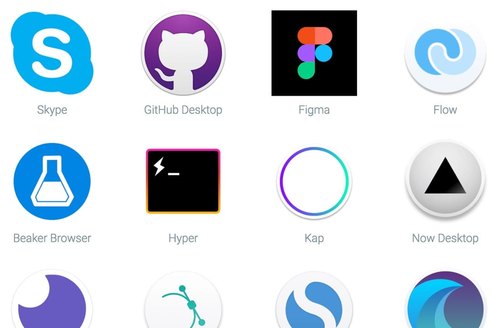

# Build an App with Electron.js

[Site and Documentation](https://electronjs.org/)

Look at the [apps built on Electron](https://electronjs.org/apps)! You might be surprised.



## I. Use the package or a CLI

- Electron.js can be installed separatately as a package.

```bash
$ npm install -D electron@latest
```

- Or you can use a CLI to work faster! [Lots to choose from.](https://electronjs.org/docs/tutorial/boilerplates-and-clis)

## II. Bootstrap with electron-forge

I recommend [electron-forge templates](https://electronforge.io/templates) because they are ready to use without much configuration.

1. Install cli globally

```bash
$ npm install -g electron-forge
```

2. Initialize new project

```bash
$ electron-forge init my-new-project
```

3. Launch your app

```bash
$ cd my-new-project
$ electron-forge start
```

## III. How to debug

Uncomment this line index.js

```js
// mainWindow.webContents.openDevTools();
```

## IV. How to add jQuery

How to add jquery or other common packages. Use npm!

```
$ npm install jquery --save
```

And add this line to the index.html file:

```js
<script>window.$ = window.jQuery = require('jquery');</script>
```

## V. How to deploy

Take a look at the [available CLI commands](https://electronforge.io/cli). We'll use the make command.

```bash
$ electron-forge make [path]
```

## BONUS - How to add custom icon

Easy! After preparing a `icon.icns` file, include the path in your `package.json` file:

```js
"electronPackagerConfig": {
  ...
  "icon": "src/public/icons/mac/icon.icns"
},
```
