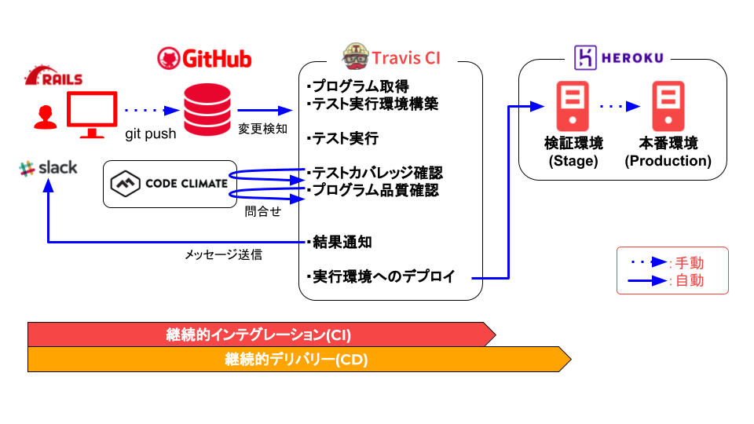

こんにちは、yosi-qです。

2019年1月12日に行われたYamagata Developer's Meetup Night!で「ソフトウェア開発における自動化とCI/CD」というタイトルで、下記のようなショートプレゼンテーションをしました。
- さまざまなツールでサポートされる自動化が、「ソフトウェア品質」と「開発の効率化」に寄与するか
- 「継続的インテグレーション(CI)」と「継続的デリバリー(CD)」の手法・考え方の紹介
- CI/CDを含めたデモ

諸事情により、ショートプレゼンテーションで使用した資料そのものの公開は控えますが、
お見せしたデモについて、特に環境構築についてまとめたいと思います。

# デモ概要

## 環境概要

構成する環境は下記の通りです。



デモ環境を構成する上で、下記が必要となります。

* GitHubへの登録（Travis CI、CodeClimateへの登録は、GitHubへの関連づけで実施します。）
* Herokuへの登録
* ローカルPCにRuby on Railsの開発環境(デモで使用したのはRails 5.1.6.1)
* Slackへの登録（メッセージ送信を省く場合は不要）

## デモシナリオ

**画面表示される文言の日本語化対応を行う**というものです。

+ [Local] 文言箇所のみを変更してGit commit/pushを行う
  + [CI] テストNG（既存のテストコードにより、表示すべき文字が異なるため）
  + [CI] Slackで結果通知
+ [Local] テストコードを変更してGit commit/pushを行う
  + [CI] テスト正常終了
  + [CI] テストカバレッジ、プログラム品質OK
  + [CI] Heroku上のStage環境にデプロイ
  + [CI] Slackで結果通知

+ [Heroku] Production環境へのデプロイ実施

なお、デモで使用したコードは、下記から[Githubに公開しています](https://github.com/yosi-q/ydmsample-201901)が、 scaffoldでサクッと作ったBlogです。
```
# rails new ydmsample-201901
# cd ydmsample-201901
# rails generate scaffold blog title:string body:text
```

## 自動テストについて

デモの中でのテストはRailsに含まれるテスト機能を使用します。
今回のシナリオでは、出力メッセージの変更程度の内容であるため、単体テストレベルでは検知させず、
**Rails 5.1以降に導入されたSystemTestCase**による、chromedriverをつかったテストで検知します。

テストコードもscaffoldが一緒に作ってくれます。便利！
ただし、一部プログラムに追記/変更が必要な部分がありますので、後ほど触れていきたいと思います。

# 環境構築

## 個別機能の環境構築
個別の外部サービスの構築方法は他のブログ記事として公開していきたいと思います。

- [Travis CI](/build-env-travis-ci)
  - GitHubリポジトリに入っているソフトウェアのビルドやテストを行うCIツール
  - 公開リポジトリは無料で使用可能
  - デモではビルド結果をHeroku上にデプロイするよう設定します。
- [CodeClimate - Quality](/build-env-codeclimate)
  - Gitリポジトリやファイルの単位で、コード品質を測定するCIツール（Github以外のサポートもあり）
  - 公開リポジトリは無料で使用可能
  - テストカバレッジの測定にも対応しており、デモではこちらも合わせて使います。
- Heroku上のPipeline機能 (※作成後、リンクを設定します)
  - Herokuは作成したアプリケーションを実行するPaaS環境として使用
  - さらにPipeline機能を使用し、CD部分をカバーします（StageからProductionへのデプロイ）

## 各ツールを連携される際の考慮点

Travis CIを中心に何をさせるか、どう連携するかの部分で考慮すべき部分を挙げます。
結局のところ、`.travis.yml`をどのように設定するかという話になります。

最終的にデモ環境で使用した`.travis.yml`は[こちら](https://github.com/yosi-q/ydmsample-201901/blob/master/.travis.yml)から確認できます。

### Travis CIでRailsのテストを実行させる

Travis CIはDockerコンテナを使って環境を都度環境構築・テストを実行しますが、
SystemTestCase実行時に使用するchromedriverは存在しないようです。
chromedriverをインストールする作業ということで、`.travis.yml`には下記のような記述を追加します。

```yml
before_install:
  - wget http://chromedriver.storage.googleapis.com/2.34/chromedriver_linux64.zip
  - unzip chromedriver_linux64.zip
  - sudo apt-get install libnss3
  - sudo apt-get --only-upgrade install google-chrome-stable
  - sudo cp chromedriver /usr/local/bin/.
  - sudo chmod +x /usr/local/bin/chromedriver
  - export DISPLAY=:99.0
  - sh -e /etc/init.d/xvfb start
  - sleep 3
addons:
  sources: google-chrome
  apt:
    packages: google-chrome-stable
```
- `before_install`で、ChromeDriverを入れ、実行権限＆実行環境を整える
- `addons`で、Google Chromeの安定板を取り入れている

解説により書きっぷりは色々あるようですが、要はChromeDriverを入れて、実行できるようにするのがポイントです。。

### CodeClimateでテストカバレッジ確認する方法
Travis CI上で実行したテストを元に、CodeClimateでテストカバレッジを確認するように設定します。

`.travis-ci.yml`では下記のように設定します。

```yml
env:
  global:
    - CC_TEST_REPORTER_ID=[CodeClimateのREPORTER IDを設定]
before_install:
  - curl -L https://codeclimate.com/downloads/test-reporter/test-reporter-latest-linux-amd64 > ./cc-test-reporter
  - chmod +x ./cc-test-reporter
  - ./cc-test-reporter before-build
after_script:
  - ./cc-test-reporter after-build --exit-code $TRAVIS_TEST_RESULT
```

- `env`では、CodeClimateのREPORTER IDを環境変数として定義
- `before_install`では、CodeClimateに実行結果を連携するためのツールを入れ、環境を整えている
- `after_script`(テスト実行箇所である`script`が完了したあと)に結果を連携する

また、結果を取得するために、RoRのテストヘルパー`test_helper.rb`の冒頭に下記を追加します。
（これを入れ忘れると、カバレッジはとれません）

```ruby
require 'simplecov'

SimpleCov.start
```
※Gemfileもsimplecovがenvironment「test」で使用されるよう追加しましょう。

### Heroku環境にデプロイする

Herokuがもともと持っている連携機能でもデプロイは自動で動きますが、
今回はTravis CIがデプロイを行うように設定しました。

`.travis-ci.yml`で下記のように設定します。

```yml
deploy:
  provider: heroku
  api_key:
    secure: [API Keyの暗号化文字列]
  app: ydmsample-201901-stage #リリース対象のdyno
  on:
    repo: yosi-q/ydmsample-201901 #取得元Repos
  run:
    - bundle exec rake db:migrate #デプロイ後に実行するコマンド
```

API Keyの暗号化には`travis`コマンドを使用します。（導入方法は[Travis CIの導入記事](/build-env-travis-ci)をご覧ください）

下記のようにherokuのAuth Tokenもコマンドに含めると意識せずに暗号化文字列が取得できます。

```
# heroku login
# travis login
# travis encrypt $(heroku auth:token) -r yosi-q/ydmsample-201901
 ›   Warning: token will expire MM/DD/YYYY
 ›   Use heroku authorizations:create to generate a long-term token
Please add the following to your .travis.yml file:

  secure: [API Keyの暗号化文字列]
```

※この内容については、Travis CIの[本家Docs](https://docs.travis-ci.com/user/deployment/heroku/)で詳細を知ることができます。
